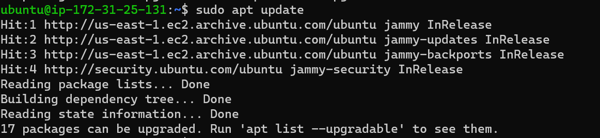
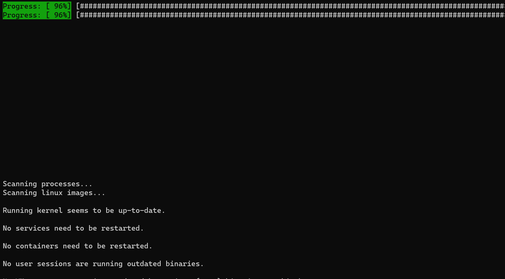
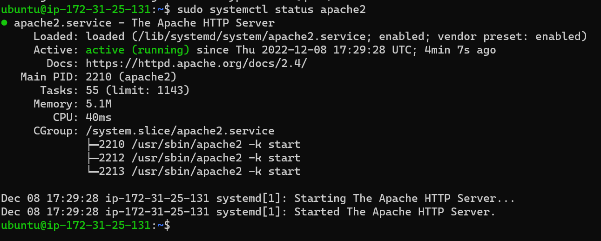

# LAMP STACK IMPLEMENTATION ON AWS

## Step 1
### Update the linux package repository
`sudo apt update`
	

## Step 2
### Run Apache2 package installation
`sudo apt install apache2`
	

## Step 3
### Verify the status of apache2
`sudo systemctl status apache2`
	

Note: *if it shows green and 'active (running)' then you're on track*

## Step 4
### Confirm you can reach the apache server