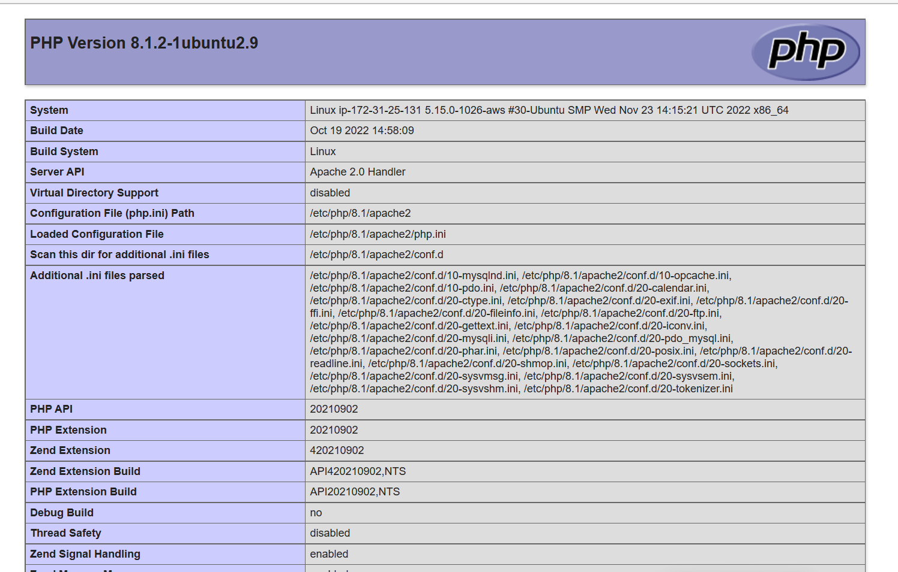

# LAMP STACK IMPLEMENTATION ON AWS

## Step 1 [Install Apache Server]
### Update the linux package repository
`sudo apt update`


## Next
### Run Apache2 package installation
`sudo apt install apache2`


## Next
### Verify the status of apache2
`sudo systemctl status apache2`


Note: *if it shows green and 'active (running)' then you're on track*

## Next
### Confirm you can reach the apache server
 - Type the code below in the terminal to reveal your public ip address

 `http://169.254.169.254/latest/meta-data/public-ipv4`

 - Open any browser of your choice and type in the address bar the <public_ip_address:80>   e.g. `52.15.25.112:80` and hit enter.

You should see the Apache page as shown in the image below


*If you see the following page, then your webserver is now correctly installed and accessible through your firewall.*

## Step 2 [Install MySQL Database]
### Run the following codes on the terminal
`sudo apt install mysql-server`


### Next login to MySQL console by typing the code
`sudo mysql`

*This will connect to the MySQL server as the administrative database user root, which is
inferred by the use of sudo when running this command. You should see output like this:*


it’s recommended that you run a security script that comes pre-installed with MySQL.
This script will remove some insecure default settings and lock down access to your
database system. Before running the script, you will set a password for the root user using mysql_native_password as default authentication method. We’re defining this
user’s password as PassWord.1
### Run the code below to set the password 
```
ALTER USER 'root'@'localhost' IDENTIFIED WITH mysql_native_password by 'PassWord.1';
```
### Next exit MySQL by typing `exit` ans hit enter to exit MySQL console

### Next is securing the securing MySQL installation by running the interactive script below

`sudo mysql_secure_installation`


When you’re finished, test if you’re able to login to the MySQL console by typing:
`sudo mysql-p`
Notice the -p flag in this command, which will prompt you for the password used after changing the root user password.


To exit the MySQL console, type: `exit`

## Step 3 [Installing  PHP]
`PHP` is the component of our setup that will process code to display
dynamic content to the end user. In addition to the php package, you’ll need `php-mysql`,
a PHP module that allows PHP to communicate with MySQL-based databases.You’ll also need `libapache2-mod-php` to enable Apache to handle PHP files. Core PHP
packages will automatically be installed as dependencies.
To install these 3 packages at once, run:

`sudo apt install php libapache2-mod-php php-mysql`


At this point, your LAMP stack is completely installed and fully operational.

 - Linux (Ubuntu)
 - Apache Http Server
 - My SQL
 - PHP

To test your setup with a PHP script, it’s best to setup a proper Apache Virtual Host to hold your website’s files and folders. Virtual host allows you to have multiple websites located on a single machine and users of the websites will not even notice it.
## Step 4 [Creating a Virtual Host For Our Website Using Apache]
In this step, you will setup a domain called project lamp, but you can replace this with any domain of your choice. I am using 'projectlamp'. 

Apache on Ubuntu 22.04 has one server block enabled by default that is configured to serve documents from the `/var/www/html` directory.
We will leave this configuration as it is and will add our own directory next to the default one.

Create the directory for projectlamp using the `mkdir` command as follows:
`sudo mkdir /var/www/projectlamp`
Next, assign ownership of the directory with your current system user:
`sudo chown -R $USER:$USER /var/www/projectlamp`
Then, create and open a new configuration file in Apache’s `sites-available` directory using your preferred command-line editor. Here, we’ll be using `vim` or `nano` (They are all command line editors):

`sudo nano /etc/apache2/sites-available/projectlamp.conf`

This will create a new blankfile. Paste in the following bare-bones configuration by pressing i on the keyboard to enter the insert mode, and paste the text:
```
<VirtualHost *:80>
   ServerName projectlamp
   ServerAlias www.projectlamp 
   ServerAdmin webmaster@localhost
   DocumentRoot /var/www/projectlamp
   ErrorLog ${APACHE_LOG_DIR}/error.log
   CustomLog ${APACHE_LOG_DIR}/access.log combined
</VirtualHost>
```
To save and close the file, simply follow the steps below:
1. Hit the esc button on the keyboard
2. press the ':' key on the keyboad
3. Followed by 'wq' 'w' for write and 'q' for quit
4. Hit ENTER to save the file 

You can use the ls command to show the new file in the `sites-available` directory.

`sudo ls /etc/apache2/sites-available`

You will see something like this:

000-default.conf default-ssl.conf projectlamp.conf

With this VirtualHost configuration, we’re telling Apache to serve projectlamp using `/var/www/projectlamp` as its web root directory.
You can now use `a2ensite` command to enable the new virtual host:
`sudo a2ensite projectlamp`

You might want to disable the default website that comes installed with Apache. This is required if you’re not using a custom domain name, because in this case Apache’s default configuration would overwrite your virtual host. To disable Apache’s default website use `a2dissite` command, type:

`sudo a2dissite 000-default`

To make sure your configuration file doesn’t contain syntax errors, run:

`sudo apache2ctl configtest`

Finally, reload Apache so these changes take effect:

`sudo systemctl reload apache2`

Your new website is now active, but the web root `/var/www/projectlamp` is still empty.
Create an index.html file in that location so that we can test that the virtual host works as expected:
```
sudo echo 'Hello LAMP from hostname' $(curl -s http://169.254.169.254/latest/meta￾data/public-hostname)'with public IP '$(curl -s http://169.254.169.254/latest/meta￾data/public-ipv4)> /var/www/projectlamp/index.html
```

Now go to your browser and try to open your website 
URL using IPaddress:
http://Public-IP-Address:80

If you see the text from ‘echo’ command you wrote to index.html file, then it means your Apache virtual host is working as expected.

You can leave this file in place as a temporary landing page for your application until you setup an index.php file to replace it. Once you do that, remember to remove or rename the index.html file from your document root, as it would take precedence over an index.php file by default.

## Step 5 [Enabling PHP On The Website]

With the default DirectoryIndex settings on Apache, a filenamed index.html will always take precedence over an index.php file. This is useful for setting up maintenance pages in PHP applications, by creating a temporary index.html file containing an informative message to visitors. Because this page will take precedence over the index.php page, it will then become the landing page for the application. Once maintenance is over, the index.html is rename dorremoved from the document root, bringing back the regular application page. In case you want to change this behavior, you’ll need to edit the `/etc/apache2/mods￾enabled/dir.conf` file and change the order in which the index.php file is listed within
the 'DirectoryIndex' directive:

`sudo nano /etc/apache2/mods-enabled/dir.conf`
```
<IfModule mod_dir.c>
        #Change this:
        #DirectoryIndex index.html index.cgi index.pl index.php index.xhtml index.htm
        #To this:
        DirectoryIndex index.php index.html index.cgi index.pl index.xhtml index.htm
</IfModule>
```
After saving and closing the file, you will need to reload Apache so the changes will take effect:

`sudo systemctl reload apache2`

Finally, we will create a PHP script to test that PHP is correctly installed and configured on your server.
Now that you have a custom location to host your website’s files and folders, we’ll create a PHPtest script to confirm that Apache is able to handle and process requests for PHP files.
Create a new file named index.php inside your custom webroot folder:

`nano /var/www/projectlamp/index.php`

This will open a blank file. Add the 
 following text, which is a valid PHP code, inside the file:

```
<?php
phpinfo();
```

When you are finished, save and close the file, refresh the page and you will see a page
similar to this:



This page provides information about your server from the perspective of PHP. It is useful for debugging and to ensure that your settings are being applied correctly.
If you can see this page in your browser, then your PHP installation is working as expected.
After checking the relevant information about your PHP server through that page, it’s best to remove the file you created as it contains sensitive information about your PHP environment and your Ubuntu server. You can use `rm` to do so:

`sudo rm /var/www/projectlamp/index.php`

You can always recreate this page if you need to access the information again later.